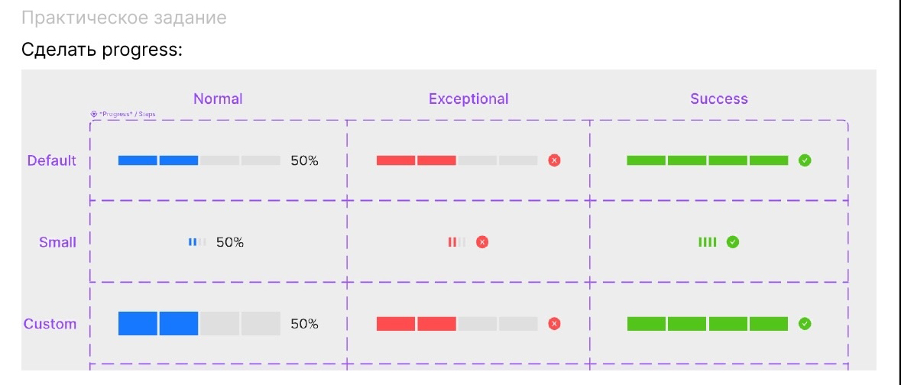

Экзамен по курсу "Проектирование интерфейсов UI/UX"
====================================================

Устные вопросы
--------------

Ниже приведены примеры реальных устных вопросов, которые задаются на экзамене:

1. Правило внутреннего и внешнего
2. Закон Джейкоба
3. Как сделать хороший дизайн

---

1. Исследование рынка. Что это и для чего нужно
2. Эффект фон Ресторфа
3. Виды сеток

---

1. Что такое дизайн
2. Закон Джейкоба
3. Автолейаут и его виды

---

1. Правило внутреннего и внешнего
2. Что такое лейаут и его типы
3. Что такое композиция и как ее создать

---

1. Этапы создания системы шрифтов
2. Закон Фиттса
3. Что такое юзабилити

---

1. Условные типы элементов интерфейса
2. Закон Миллера
3. Атрибут шрифта: начертание

---

1. Что такое сетка
2. Закон Фиттса
3. Этапы разработки интерфейса в реальных условиях

---

1. Правило якорных объектов
2. Трекинг. Отличие от кернинга
3. Условные типы элементов интерфейса

---

1. Исследование рынка. Что это и для чего нужно
2. Закон близости
3. Виды сеток

---

1. Правило эстетического эффекта юзабилити
2. 3 правила юзабилити
3. Что такое композиция и как ее создать

---

1. Для чего нужен дизайн интерфейсов
2. Этапы создания системы шрифтов
3. Эффект фон Ресторфа

---

1. Трекинг. Отличие от кернинга
2. Закон Прэгнантца
3. Что такое аксессабилити и как можно на него влиять

---

Практические задания
--------------------

Ниже приведены примеры практических заданий, которые могут быть на экзамене. Для каждого задания студенту предлагается реализовать определённый UI-компонент или элемент интерфейса.

**Сделать steps:**

---

**Сделать карточку:**

---

**Сделать tour:**

---

**Сделать компонент Message:**

---

**Сделать datepicker:**

---

**Сделать пагинацию:**

---

**Сделать 24-колоночную сетку:**

---

**Сделать tree:**

---

**Сделать autocomplete:**

---

**Сделать компонент statistic:**

---

**Сделать rate:**

---

**Сделать progress:**

---
